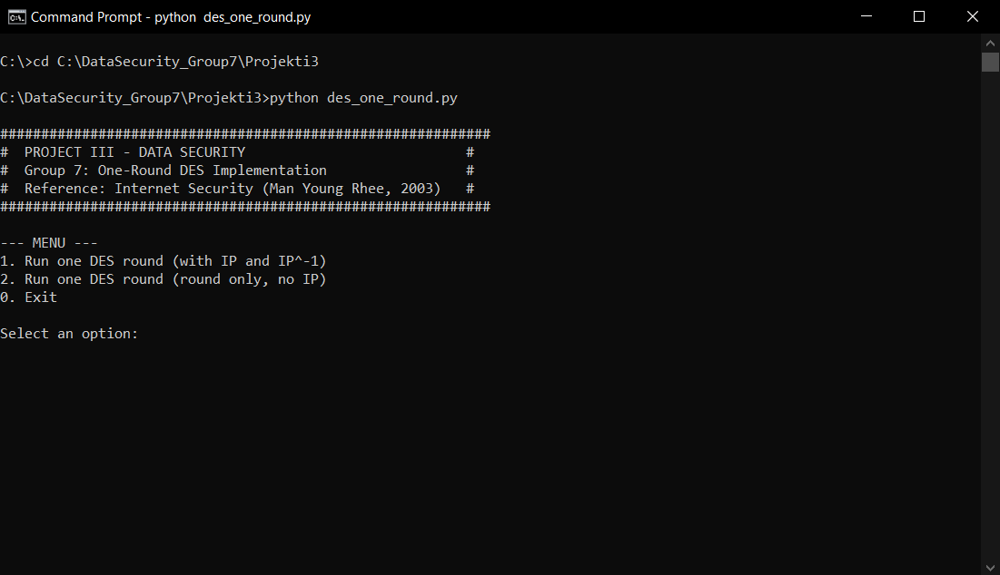
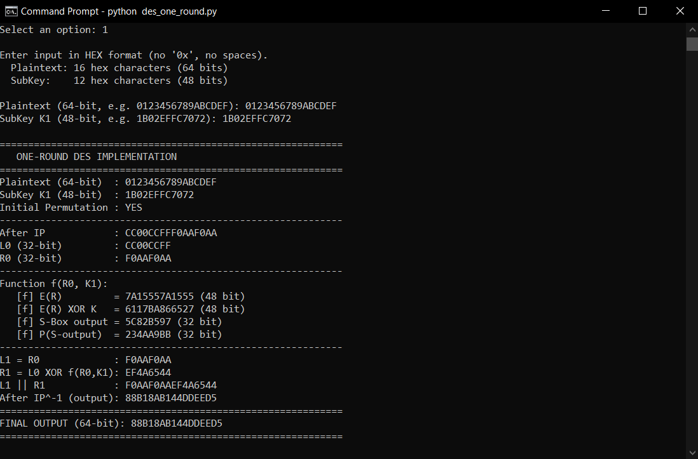
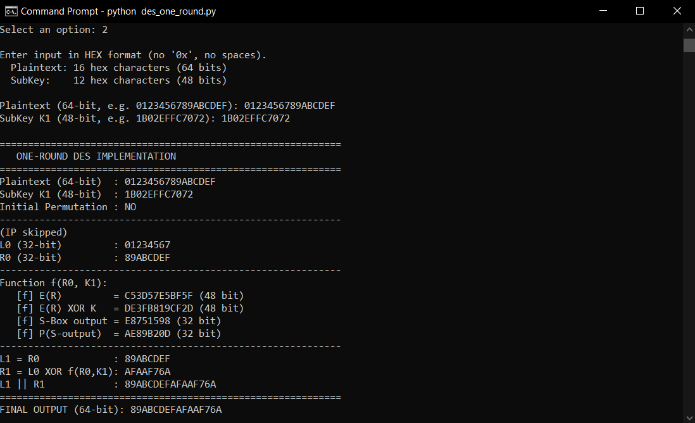
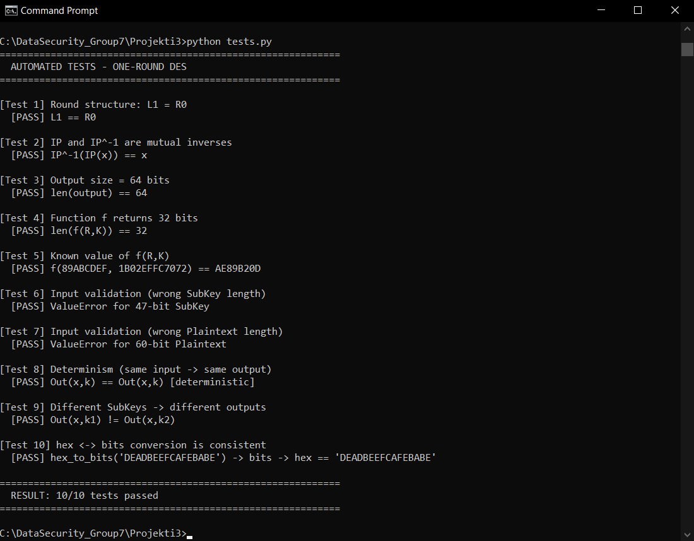

# Project III — Data Security

## Group 7: One-Round DES Implementation

> **Topic:** Write an application that implements only one Round of the DES Algorithm. The SubKey must NOT be generated automatically — it must be provided to the application manually.
>
> **Reference:** Internet Security – Cryptographic Principles, Algorithms and Protocols (Man Young Rhee, John Wiley & Sons, 2003), **Figures 3.1 and 3.2, page 59**.

---

## Table of Contents

- [Project Description](#project-description)
- [How a DES Round Works](#how-a-des-round-works)
- [Project Structure](#project-structure)
- [How to Run](#how-to-run)
- [Example Execution](#example-execution)
- [Testing](#testing)
- [Tables Used](#tables-used)

---

## Project Description

This application implements **only one Round** of the standard DES algorithm (Data Encryption Standard, FIPS 46-3). Unlike the full DES algorithm which has 16 rounds and generates 16 subkeys from an initial 64-bit key, this application:

- Implements **only 1 round**.
- **Does NOT generate** the SubKey automatically (no Key Schedule).
- Allows the user to provide the 48-bit SubKey **manually** as input.
- Allows choosing between two modes:
  - **With IP and IP⁻¹** (Initial and Final Permutation, per Figure 3.1)
  - **Round only** (without IP/IP⁻¹ permutations, per Figure 3.2)
 
## How a DES Round Works

According to **Figure 3.2** of the reference book, one DES round contains the following steps:

```
              Plaintext 64-bit
                     │
              [IP (optional)]
                     │
        ┌────────────┴────────────┐
        │                         │
     L0 (32-bit)               R0 (32-bit)
        │                         │
        │              ┌──────────┤
        │              │          │
        │       ┌──────▼──────┐   │
        │       │ Function f  │◄──┤  SubKey K1 (48-bit, manual)
        │       └──────┬──────┘   │
        │              │          │
        └──────► XOR ◄─┘          │
                  │               │
                  ▼               ▼
              R1 (32-bit)     L1 = R0
                  │               │
                  └───────┬───────┘
                          │
                       L1 || R1
                          │
                  [IP⁻¹ (optional)]
                          │
                    Ciphertext 64-bit
```

### The f(R, K) Function — the Heart of DES

```
   R (32-bit)            K (48-bit, manually provided SubKey)
       │                         │
       ▼                         │
   ┌───────┐                     │
   │   E   │  Expansion: 32 → 48 bit
   └───┬───┘                     │
       │ (48-bit)                │
       └──────────► XOR ◄────────┘
                    │ (48-bit)
                    ▼
             ┌─────────────┐
             │  8 S-Boxes  │  Each 6-bit → 4-bit
             └──────┬──────┘
                    │ (32-bit)
                    ▼
                ┌───────┐
                │   P   │  Permutation 32 → 32 bit
                └───┬───┘
                    │
                    ▼ (32-bit)
                f(R, K)
```

### Formulas
- `L₁ = R₀`
- `R₁ = L₀ ⊕ f(R₀, K₁)`

## Project Structure

```
des-one-round/
├── des_one_round.py   # Main script (algorithm + CLI)
├── tests.py           # Automated tests
├── README.md          # This file
├── screenshots/       # Screenshots used in README
│   ├── menu.png
│   ├── option1.png
│   ├── option2.png
│   └── tests.png
└── .gitignore
```

## How to Run

### Requirements
- **Python 3.8+** (no external libraries required — standard library only)

### Run
```bash
python3 des_one_round.py
```

The application will open with an interactive menu:

```
--- MENU ---
1. Run one DES round (with IP and IP^-1)
2. Run one DES round (round only, no IP)
0. Exit
```

### Input Format
- **Plaintext**: 16 hex characters (= 64 bits), e.g. `0123456789ABCDEF`
- **SubKey K1**: 12 hex characters (= 48 bits), e.g. `1B02EFFC7072`

## Example Execution

```
Plaintext (64-bit)  : 0123456789ABCDEF
SubKey K1 (48-bit)  : 1B02EFFC7072
Initial Permutation : NO
------------------------------------------------------------
(IP skipped)
L0 (32-bit)         : 01234567
R0 (32-bit)         : 89ABCDEF
------------------------------------------------------------
Function f(R0, K1):
   [f] E(R)         = C53D57E5BF5F (48 bit)
   [f] E(R) XOR K   = DE3FB819CF2D (48 bit)
   [f] S-Box output = E8751598 (32 bit)
   [f] P(S-output)  = AE89B20D (32 bit)
------------------------------------------------------------
L1 = R0             : 89ABCDEF
R1 = L0 XOR f(R0,K1): AFAAF76A
L1 || R1            : 89ABCDEFAFAAF76A
============================================================
FINAL OUTPUT (64-bit): 89ABCDEFAFAAF76A
============================================================
```

Note: L1 = 89ABCDEF = R0 (the right half of the original plaintext), exactly as required by the formula `L₁ = R₀`. ✓

## Screenshots

### Main Menu
The application starts with an interactive menu where the user can choose between two execution modes or exit.



### Option 1 — Round with IP and IP⁻¹ (Figure 3.1)
Demonstrates the full structure: Initial Permutation → Round → Final Permutation.



### Option 2 — Round only, without IP (Figure 3.2)
Demonstrates only the internal structure of a single round, without the initial and final permutations. Note that `L1` equals the right half of the original plaintext, confirming the formula `L₁ = R₀`.



### Automated Tests (`tests.py`)
Result of running the automated test suite, verifying the correctness of the implementation across 10 different test cases.



## Testing

To run the automated tests:

```bash
python3 tests.py
```

The tests verify:
1. The Round structure (`L₁ = R₀`)
2. Correctness of the tables (IP⁻¹(IP(x)) = x)
3. The XOR operation with the SubKey
4. Correct output size (64-bit)
5. Validation of invalid input

## Tables Used

All tables follow the FIPS 46-3 standard and are identical to those presented in Man Young Rhee's "Internet Security" book:

| Table | Size | Description |
|-------|------|-------------|
| **IP** | 64 → 64 | Initial Permutation |
| **IP⁻¹** | 64 → 64 | Final Permutation |
| **E** | 32 → 48 | Expansion (extends R) |
| **P** | 32 → 32 | Permutation inside the f function |
| **S-Boxes (S1-S8)** | 6 → 4 | 8 substitution tables |

## Authors

- Gjelbrim Morina
- Arbenit Krasniqi
